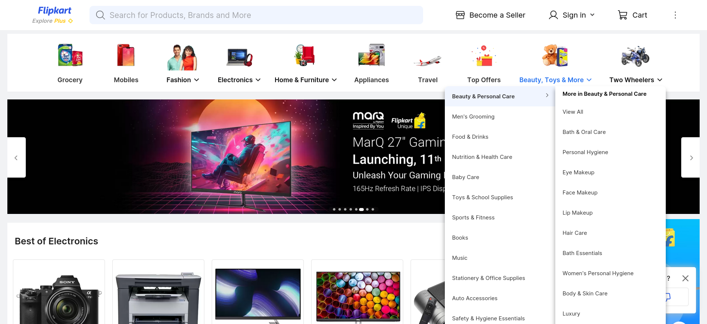

# Flipkart Clone with Admin Feature

Welcome to the Flipkart Clone with Admin Feature project! This project is a clone of the popular e-commerce platform Flipkart, with added admin functionality. It is built using React, HTML, CSS, Node.js, MongoDB, Mongoose, and RESTful API.

## Description

The Flipkart Clone with Admin Feature project aims to replicate the key features and functionalities of the Flipkart e-commerce platform. In addition, it incorporates an admin feature that allows authorized users to manage products, orders, inventory, and other administrative tasks.

## Demo Link

You can access a live demo of the Flipkart Clone with 

## Technologies Used

The Flipkart Clone with Admin Feature project is built using the following technologies and tools:

- React
- HTML
- CSS
- Node.js
- MongoDB
- Mongoose
- RESTful API

## Features

- User registration and authentication.
- Browse and search for products.
- Add products to the cart and place orders.
- Admin panel for managing products, inventory, and orders.
- Responsive design for optimal viewing on various devices.

## Installation

To run this project locally, follow these steps:

1. Clone the repository: `git clone https://github.com/ashwintelmore/flipkart-clone.git`
2. Navigate to the project directory: `cd flipkart-clone`
3. Install dependencies: `npm install`
4. Start the development server: `npm start`

## Usage

Upon opening the Flipkart Clone with Admin Feature project, users can browse and search for products, add items to the cart, and place orders. Authorized users with admin privileges can access the admin panel to manage products, inventory, and orders.

## Contributing

Contributions, feedback, and suggestions for improving this project are welcome. If you have any ideas or find any issues, please open an issue or submit a pull request.

## Contact

If you have any questions or feedback, feel free to reach out to me:

- Email: [developer@ashwintelmore.com](mailto:developer@ashwintelmore.com)
- LinkedIn: [LinkedIn Profile](https://www.linkedin.com/in/ashwintelmore/)

Thank you for visiting the Flipkart Clone with Admin Feature project! Enjoy exploring and using the e-commerce and admin functionalities.
